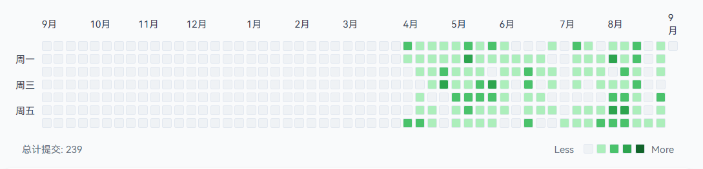

# Vue GitHub Contribution Calendar | Vue GitHub 贡献日历

<div align="center">
  <h3>🎯 一个基于 Vue 3 的 GitHub 风格贡献日历组件</h3>
  <p>A Vue 3 based GitHub-style contribution calendar component</p>
</div>

## 样式 | Preview


## ✨ 功能特性 | Features

- 🎨 **GitHub 风格设计** - 完美还原 GitHub 贡献图的视觉效果
- 📱 **响应式设计** - 适配移动端和桌面端显示
- 🌐 **国际化支持** - 支持中文和英文语言切换
- 🎯 **交互功能** - 点击日期查看详细贡献信息
- 🎨 **自定义配色** - 支持自定义颜色主题
- 📊 **数据统计** - 显示总提交数和贡献强度
- ⚡ **高性能** - 基于 Vue 3 Composition API，性能优异
- 🔧 **易于集成** - 简单的 API 设计，易于集成到现有项目

## 🚀 技术栈 | Tech Stack

- **Vue 3** - 渐进式 JavaScript 框架
- **Vite** - 下一代前端构建工具
- **Tailwind CSS** - 实用优先的 CSS 框架
- **Day.js** - 轻量级日期处理库

## 📦 安装 | Installation

```bash
# 克隆项目
git clone https://github.com/your-username/vue-github-contribution-calender.git

# 进入项目目录
cd vue-github-contribution-calender

# 安装依赖
npm install

# 启动开发服务器
npm run dev
```

## 🎮 使用方法 | Usage

### 基础用法

```vue
<template>
  <ActiveGraph
    :contributions="contributionData"
    :total="totalCommits"
    lang="zh"
    @click="handleDayClick"
  />
</template>

<script setup>
import ActiveGraph from './components/ActiveGraph.vue'

const contributionData = [
  // 贡献数据格式
  [
    {
      date: '2024-01-01',
      count: 5,
      intensity: 2
    }
    // ... 更多数据
  ]
]

const totalCommits = 150

const handleDayClick = (day) => {
  console.log('点击日期:', day.date, '提交数:', day.count)
}
</script>
```

### Props 参数

| 参数 | 类型 | 默认值 | 说明 |
|------|------|--------|------|
| `contributions` | Array | `[]` | 贡献数据数组 |
| `total` | Number | `0` | 总提交数 |
| `colorLevels` | Object | 见下方 | 自定义颜色配置 |
| `lang` | String | `'zh'` | 语言设置 (`'zh'` 或 `'en'`) |

### 默认颜色配置

```javascript
const colorLevels = {
  0: '#eff2f5',  // 无贡献
  1: '#aceebb',  // 低贡献
  2: '#4ac26b',  // 中等贡献
  3: '#2da44e',  // 高贡献
  4: '#116329'   // 超高贡献
}
```

### 数据格式

```javascript
// 贡献数据结构
const contributionData = [
  // 每个数组代表一周（7天）
  [
    {
      date: '2024-01-01',    // 日期字符串 (YYYY-MM-DD)
      count: 3,             // 提交次数
      intensity: 1          // 强度等级 (0-4)
    },
    // ... 一周内的其他天
  ],
  // ... 其他周的数据
]
```

## 🎨 自定义样式 | Custom Styling

### 修改颜色主题

```vue
<template>
  <ActiveGraph
    :contributions="contributionData"
    :total="totalCommits"
    :color-levels="customColors"
  />
</template>

<script setup>
const customColors = {
  0: '#f0f0f0',
  1: '#c6e48b',
  2: '#7bc96f',
  3: '#239a3b',
  4: '#196127'
}
</script>
```

### CSS 变量自定义

```css
.contribution-chart {
  --grid-gap: 4px;
  --cell-size: 12px;
  --cell-radius: 2px;
}
```

## 📱 响应式设计 | Responsive Design

组件已内置响应式设计，在移动端会自动调整：
- 字体大小自适应
- 网格间距优化
- 触摸交互支持

## 🔧 开发 | Development

```bash
# 开发模式
npm run dev

# 构建生产版本
npm run build

# 预览构建结果
npm run preview
```

## 📁 项目结构 | Project Structure

```
vue-github-contribution-calender/
├── src/
│   ├── components/
│   │   └── ActiveGraph.vue      # 主要组件
│   ├── assets/
│   │   └── changelog.json       # 示例数据
│   ├── App.vue                  # 应用入口
│   └── main.js                  # 主要 JS 文件
├── public/
├── package.json
├── vite.config.js
├── tailwind.config.js
└── README.md
```

## 🎯 核心组件 API | Core Component API

### ActiveGraph 组件

#### Events

| 事件名 | 参数 | 说明 |
|--------|------|------|
| `click` | `(day: Object)` | 点击某一天时触发 |

#### day 对象结构

```javascript
{
  date: '2024-01-01',        // 日期
  count: 5,                  // 提交数
  intensity: 2,              // 强度等级
  backgroundColor: '#4ac26b' // 背景色
}
```

## 🌟 最佳实践 | Best Practices

### 1. 数据预处理

```javascript
// 将 Git 提交记录转换为贡献数据
const convertCommitsToContributionData = (commits) => {
  const commitCounts = {}
  
  commits.forEach(commit => {
    const dateStr = dayjs(commit.date).format('YYYY-MM-DD')
    commitCounts[dateStr] = (commitCounts[dateStr] || 0) + 1
  })

  // 生成固定 53 周的数据
  const contributionData = []
  // ... 数据处理逻辑
  
  return contributionData
}
```

## 🐛 常见问题 | FAQ

### Q: 能否自定义时间范围？
A: 当前版本固定显示过去 53 周，后续版本将支持自定义时间范围。

### Q: 如何集成到现有项目？
A: 复制 `ActiveGraph.vue` 组件到您的项目中，安装必要的依赖即可使用。

## 🤝 贡献 | Contributing

欢迎提交 Issue 和 Pull Request！

1. Fork 本项目
2. 创建特性分支 (`git checkout -b feature/AmazingFeature`)
3. 提交更改 (`git commit -m 'Add some AmazingFeature'`)
4. 推送到分支 (`git push origin feature/AmazingFeature`)
5. 打开 Pull Request

## 📄 许可证 | License

本项目采用 MIT 许可证 - 详见 [LICENSE](LICENSE) 文件

## 🙏 致谢 | Acknowledgments

- [GitHub](https://github.com) - 设计灵感来源
- [Vue.js](https://vuejs.org) - 出色的前端框架
- [Tailwind CSS](https://tailwindcss.com) - 优秀的 CSS 框架

---

<div align="center">
  <p>如果这个项目对您有帮助，请给个 ⭐ Star 支持一下！</p>
  <p>Made with ❤️ by HurryWang</p>
</div>